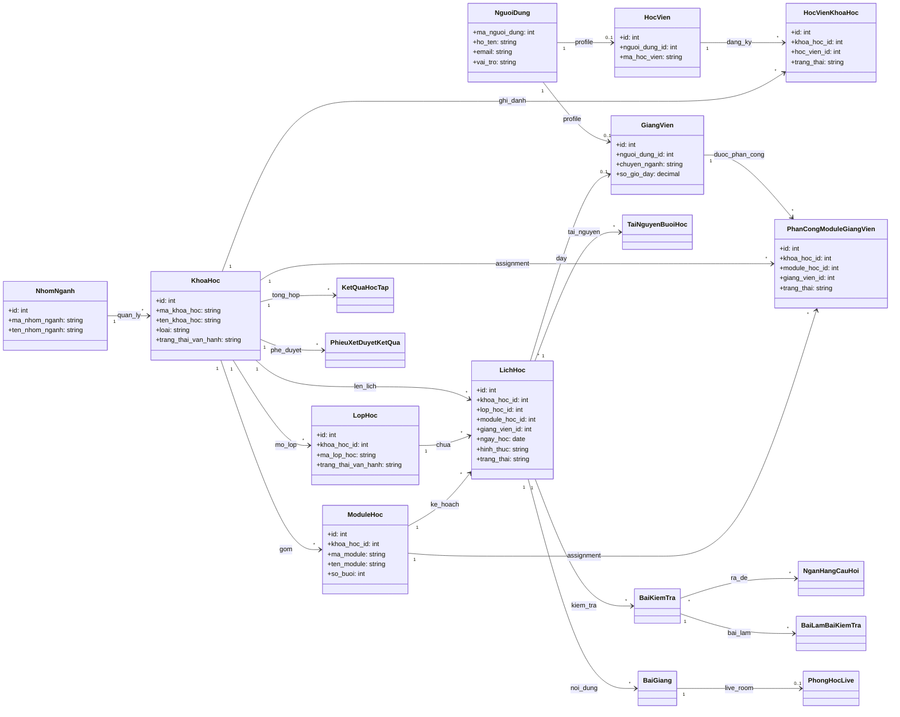
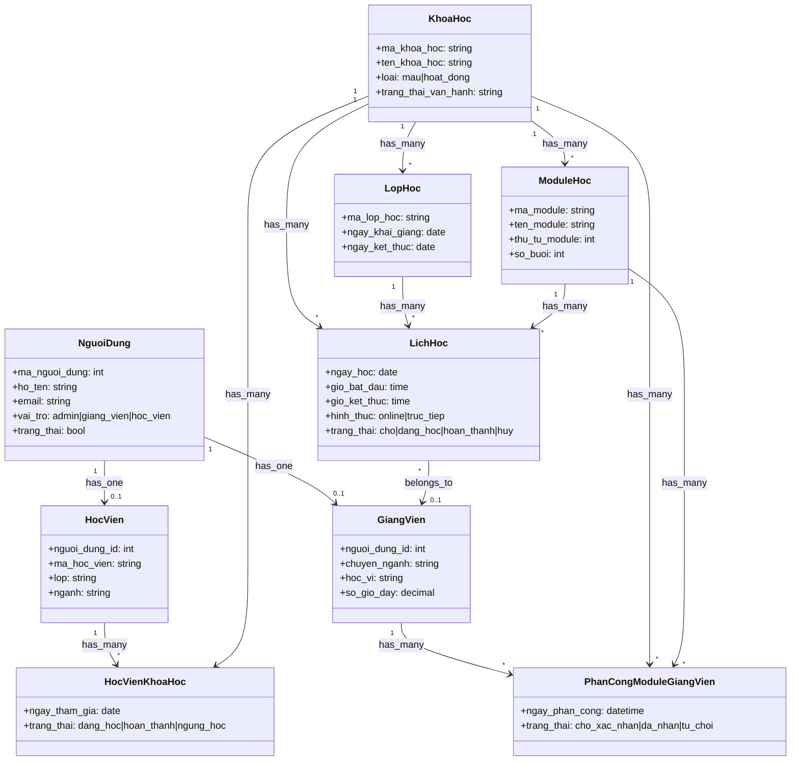
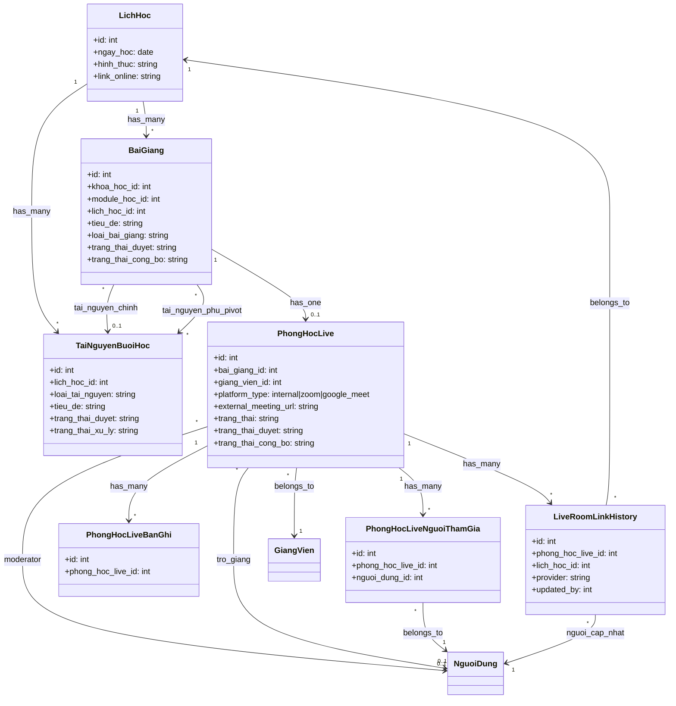
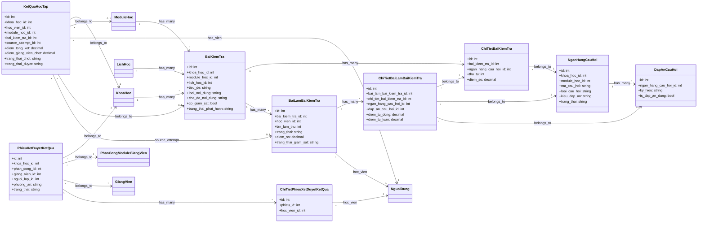

# Class Diagram Starter

Tai lieu nay gom 4 phan:
- Overview toan he thong
- Nhom Nguoi dung - Dao tao
- Nhom Noi dung - Live room
- Nhom Kiem tra - Ket qua

Muc tieu la ve so do class de doc kien truc domain. Vi vay chi nen giu:
- Ten class
- Mot vai thuoc tinh quan trong
- Quan he 1-1, 1-n, n-n

Khong nen dua het accessor/scope/service helper vao class diagram, neu khong so do se rat roi.

## 1. Overview

## 2. Nguoi dung - Dao tao

## 3. Noi dung - Live room

## 4. Kiem tra - Ket qua

## 5. Cach ve dung cho project nay

1. Bat dau tu `app/Models`, khong bat dau tu controller.
2. Moi class chi nen giu 3-6 thuoc tinh quan trong nhat.
3. Quan he pivot nen ve thanh class rieng neu pivot co nghiep vu:
   `HocVienKhoaHoc`, `PhanCongModuleGiangVien`, `ChiTietBaiKiemTra`.
4. Service nhu `TeacherScheduleLiveRoomService`, `CourseResultAggregationService`, `LiveRoomPlatformService`
   nen dua vao sequence/activity diagram, khong nen day vao class diagram domain.
5. Neu ban muon lam bao cao/luan van:
   dung 1 so do overview va 2-3 so do chi tiet theo tung phan he.

## 6. Phan bo sung nen them sau

De so do day du hon, ban co the ve them 1 nhanh "Ho tro he thong":
- `ThongBao`
- `YeuCauHocVien`
- `DiemDanh`
- `DiemDanhGiangVien`
- `GiangVienDonXinNghi`
- `SystemSetting`
- `Banner`

Nhung minh khuyen nghi de nhom nay o mot so do rieng, tranh lam roi overview chinh.
